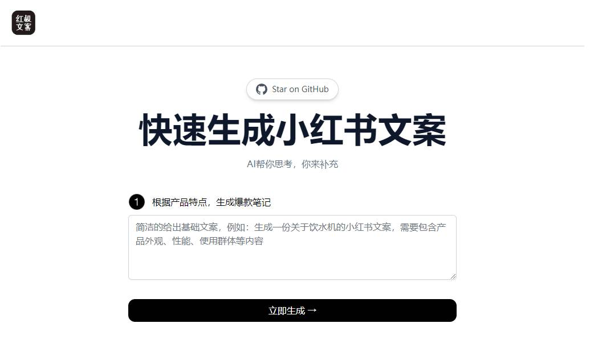

# [小紅書運營助手](https://xhsai.yobb.top/)
## [English](README.md)

简洁的给出基础文案，生成小紅書規格文案
[](https://xhsai.yobb.top/zh)


## 如何工作

这个项目主要使用了 [OpenAI GPT-3 API](https://openai.com/api/) (specifically, text-davinci-003) 和 [Vercel Edge functions](https://vercel.com/features/edge-functions) .它根据用户输入构建一个Prompt，通过Vercel Edge函数将其发送到GPT-3 API，然后将响应流传回应用程序。

## 如何运行

克隆存储库后，去 [OpenAI](https://beta.openai.com/account/api-keys) 注册一个账号，拿到API key，放到`.env`.

然后，在命令行中运行应用程序，它将在 `http://localhost:3000` 处可用。

```bash
npm run dev
```

## 线上部署

使用 [Vercel](https://vercel.com?utm_source=github&utm_medium=readme&utm_campaign=vercel-examples)部署:

[](https://vercel.com/new/clone?repository-url=https://vercel.com/new/clone?repository-url=https://github.com/JeremyTsangchina/xhs&env=OPENAI_API_KEY,NEXT_PUBLIC_USE_USER_KEY,OPENAI_MODEL&project-name=weekly_report&repo-name=weekly_report)

环境变量：
OPENAI_API_KEY = xxxxx
NEXT_PUBLIC_USE_USER_KEY = false
OPENAI_MODEL = text-davinci-003

<!-- https://www.seotraininglondon.org/gpt3-business-email-generator/ -->
<!-- [](https://xhsai.yobb.top/zh) -->

## 感謝

灵感来自 [TwtterBio](https://github.com/Nutlope/twitterbio) 、 [zhengbangbo](https://github.com/zhengbangbo/chat-simplifier)、[guaguaguaxia](https://github.com/guaguaguaxia/weekly_report). 


## 支持

如果你觉得这个工具对您有帮助，可以帮作者买一杯果汁 🍹 表示支持

[](https://xhsai.yobb.top/zh)
